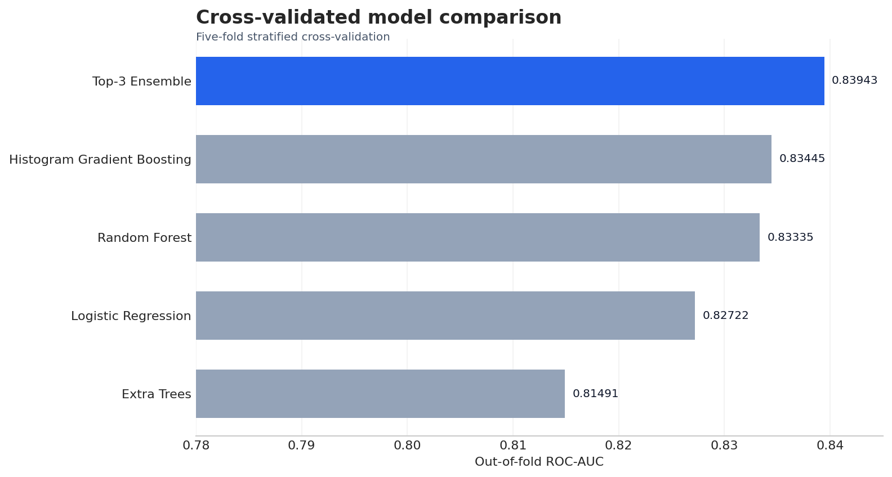

# NFL Draft Prediction

An end-to-end binary classification project developed for the GCI World tutorial competition. The project predicts the probability that an athlete is selected in the NFL Draft and emphasizes leakage-safe validation, reproducibility, and honest model comparison.



## Project overview

The primary evaluation metric is **ROC-AUC**. Four model families are evaluated under the same five-fold stratified cross-validation protocol, followed by probability-averaging ensembles. Every preprocessing step is fitted inside each training fold to avoid validation leakage.

The selected solution is an equal-weight probability ensemble of:

- Histogram Gradient Boosting
- Random Forest
- Logistic Regression

Its out-of-fold ROC-AUC is **0.83943**, with a bootstrap 95% confidence interval of **0.82317–0.85443**.

## Results

| Candidate | OOF ROC-AUC |
|---|---:|
| Top-3 probability ensemble | **0.83943** |
| Histogram Gradient Boosting | 0.83445 |
| Random Forest | 0.83335 |
| Logistic Regression | 0.82722 |
| Extra Trees | 0.81491 |

These are cross-validation estimates on the provided training data, not public or private leaderboard scores.

## What the notebook includes

- Structural data-quality and integrity checks
- Exploratory analysis of the target, missingness, feature types, and correlations
- Domain features such as BMI, Speed Score, mass-to-height ratio, test completion count, and an age-missing indicator
- Leakage-safe preprocessing with fold-local imputation, scaling, and one-hot encoding
- A consistent four-model comparison using out-of-fold predictions
- Probability-ensemble selection based on OOF ROC-AUC
- ROC, precision-recall, calibration, uncertainty, permutation-importance, and subgroup diagnostics
- Automated final fitting, prediction generation, and submission validation
- Reproducibility exports for fold metrics, OOF predictions, model comparison, feature importance, and the run summary

## Repository structure

```text
.
├── assets/
│   └── model_comparison.png
├── input/
│   ├── README.md
│   ├── train.csv
│   ├── test.csv
│   └── sample_submission.csv
├── outputs/
│   ├── README.md
│   ├── feature_importance.csv
│   ├── fold_results.csv
│   ├── model_comparison.csv
│   ├── oof_predictions.csv
│   ├── run_summary.json
│   └── submission.csv
├── scripts/
│   └── validate_repository.py
├── .gitignore
├── LICENSE
├── README.md
├── nfl_draft_prediction.ipynb
└── requirements.txt
```

## Reproduce the analysis

The recorded run used Python 3.12.13. Python 3.12 is recommended.

1. Clone the repository and enter its directory.
2. Create and activate a virtual environment.
3. Install the dependencies.
4. Obtain the three competition CSV files from the authorized GCI World competition materials and place them in `input/`.
5. Open the notebook and run all cells from top to bottom.

```bash
python -m venv .venv
```

Windows PowerShell:

```powershell
.venv\Scripts\Activate.ps1
python -m pip install --upgrade pip
python -m pip install -r requirements.txt
jupyter lab
```

macOS or Linux:

```bash
source .venv/bin/activate
python -m pip install --upgrade pip
python -m pip install -r requirements.txt
jupyter lab
```

In JupyterLab, open `nfl_draft_prediction_professional.ipynb`, then select **Restart Kernel and Run All Cells**. The notebook recreates the files in `outputs/`.

## Validate the repository

The included validation script checks the notebook structure and saved result artifacts without retraining the models:

```bash
python scripts/validate_repository.py
```

After adding the competition data, include `--require-input` to validate the local input files as well:

```bash
python scripts/validate_repository.py --require-input
```

## Reproducibility design

- Random seed: `42`
- Validation: five-fold `StratifiedKFold` with shuffling
- Selection criterion: out-of-fold ROC-AUC
- Preprocessing: learned independently inside every fold
- Submission values: continuous probabilities in `[0, 1]`
- External data: not used
- Manual prediction edits: not used

## Important limitation

Missing `Age` is the strongest learned signal in the current data. It may reflect the competition's data-collection process rather than a stable football relationship. The notebook audits this subgroup, but performance can still deteriorate if the missingness pattern changes in future data. The solution should therefore be interpreted as a competition model, not a real-world scouting system.

## Data and licensing

The raw competition CSV files are intentionally excluded from version control because the supplied materials do not state that the dataset may be redistributed publicly. Follow the competition's access and usage terms and add the files locally. The MIT License in this repository applies to the original code and documentation only; it does not grant rights to the competition data.

## Acknowledgements

The project is based on the official GCI World competition tutorial, baseline notebook, and advanced-technique notebooks supplied with the competition. The final workflow independently consolidates and improves those materials with leakage-safe preprocessing, shared out-of-fold evaluation, diagnostic analysis, and automated artifact validation.
